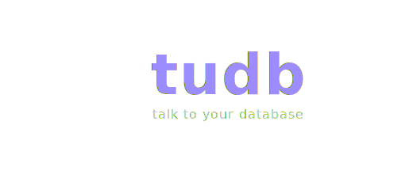

<div align="center">



### Natural Language to SQL with Multi-Database Support

Convert plain English to SQL queries across PostgreSQL, MySQL, RDS, Supabase, Neon, and Railway using AI-powered natural language processing.

[](https://tudb.bcworks.in.net)


[](https://nodejs.org/)
[](https://www.typescriptlang.org/)
[](LICENSE)

</div>

## Quick Start

```bash
npm install
npm run db:migrate
npm run dev
```

Configure `.env`:
```env
DATABASE_URL=postgresql://...
AWS_BEARER_TOKEN_BEDROCK=...
CLERK_SECRET_KEY=...
ENCRYPTION_KEY=...
```

## What It Does

Ask questions in plain English, get SQL + results:

```
"Show top 10 products by revenue"
→ SELECT name, SUM(revenue) FROM products GROUP BY name ORDER BY revenue DESC LIMIT 10
```

Supports:
- Multi-database connections
- Query optimization suggestions
- Built-in analytics dashboard
- Collaborative query sharing

## Architecture

```
admin-dashboard/    React + TS frontend
backend/           Express API + AI agents
db/               Database abstraction layer
database/         Migrations & seeds
```

## API

**Query**
```bash
POST /api/query
{
  "question": "your natural language query",
  "connectionId": "conn_123"
}
```

**Manage Connections**
```bash
GET    /api/admin/connections
POST   /api/admin/connections
PUT    /api/admin/connections/:id
DELETE /api/admin/connections/:id
```

**Inspect Schema**
```bash
GET /api/inspect/tables
GET /api/inspect/schema?table=users
```

## Development

```bash
npm run dev:backend    # :3000
npm run dev:dashboard  # :5173
npm test
```

## Deploy

```bash
npm run build
npm start
```

Set environment variables in production.

## License

ISC
